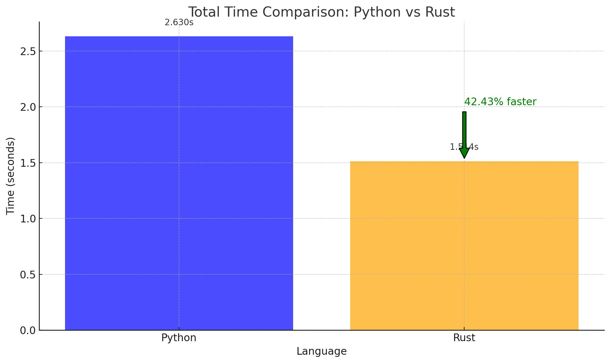

# Ownlinter

An experiment to compare the performance of a linter written in Python and one written in Rust. The linter checks for the following rules:

## Lint rules

- [x] Line not more than 80 chars
- [] No trailing spaces
- [] No tabs
- [] No more than 2 consecutive new

## Formatting Rules

- [] No more than 2 consecutive new lines
- [] Remove trailing spaces
- [] Replace tabs with spaces

## Usage

To compare Python and rust scripts, run the following command:

```bash
time python ownpylinter.py <path>
```

```bash
cargo build --release
time ./target/release/ownlinter-rust <path>
```

## Comparison


